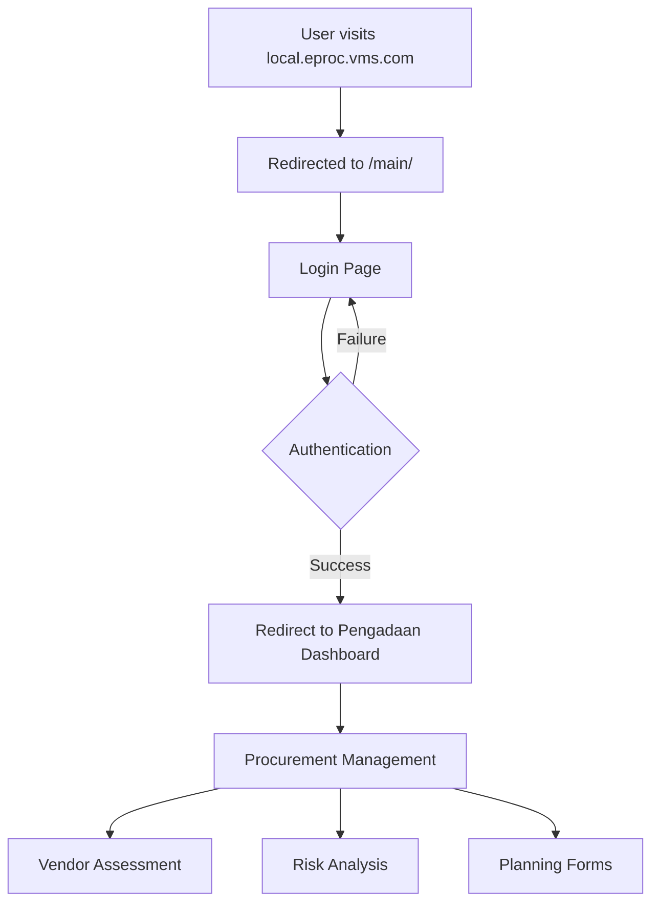

# VMS eProc System

**Enterprise Procurement & Planning Management System**

[](https://php.net)
[](https://codeigniter.com)
[](https://mysql.com)
[](#)

## 📋 Table of Contents

- [Overview](#overview)
- [System Architecture](#system-architecture)
- [Requirements](#requirements)
- [Installation](#installation)
- [Database Structure](#database-structure)
- [Application Flow](#application-flow)
- [Directory Structure](#directory-structure)
- [Configuration](#configuration)
- [Migration System](#migration-system)
- [Development Guide](#development-guide)
- [Troubleshooting](#troubleshooting)
- [Security Notes](#security-notes)

## 🎯 Overview

VMS eProc is a comprehensive enterprise procurement and planning management system built for Nusantara Regas. The system consists of two main applications:

- **Main Application**: Handles user authentication, planning, and procurement management
- **Pengadaan Application**: Manages procurement processes, vendor management, and dashboard

## 🏗️ System Architecture

```
┌─────────────────────────────────────────────────────────────┐
│                    VMS eProc System                         │
├─────────────────────────────────────────────────────────────┤
│  Frontend: IIS 10 + PHP 5.6 + CodeIgniter 3.x             │
├─────────────────────────────────────────────────────────────┤
│  ┌─────────────────┐    ┌─────────────────────────────────┐ │
│  │   Main App      │    │     Pengadaan App               │ │
│  │   (Planning)    │◄──►│     (Procurement)               │ │
│  │                 │    │                                 │ │
│  │ • Authentication│    │ • Vendor Management             │ │
│  │ • Planning      │    │ • Procurement Process           │ │
│  │ • Risk Analysis │    │ • Assessment                    │ │
│  └─────────────────┘    └─────────────────────────────────┘ │
├─────────────────────────────────────────────────────────────┤
│  Database Layer: MySQL 5.8 (Docker)                       │
│  ┌─────────────────┐    ┌─────────────────────────────────┐ │
│  │ eproc_perencanaan│    │        eproc                    │ │
│  │ (26 tables)     │    │      (93 tables)                │ │
│  └─────────────────┘    └─────────────────────────────────┘ │
└─────────────────────────────────────────────────────────────┘
```

## 💻 Requirements

### System Requirements
- **OS**: Windows Server 2016+ / Windows 10+
- **Web Server**: IIS 10
- **PHP**: 5.6.40
- **Database**: MySQL 5.8 (Docker)
- **Memory**: 4GB RAM minimum

### Dependencies
- CodeIgniter 3.x
- MySQLi Extension
- FastCGI Module for IIS
- Docker (for MySQL)

## 🚀 Installation

### 1. Prerequisites Setup

```bash
# Ensure PHP 5.6 is installed
C:\tools\php56\php.exe -v

# Verify MySQL Docker container
docker ps | findstr mysql

# Check IIS configuration
iisreset
```

### 2. Domain Configuration

Add to `C:\Windows\System32\drivers\etc\hosts`:
```
127.0.0.1 local.eproc.vms.com
```

### 3. Database Configuration

The system uses two MySQL databases:
- `eproc`: Main procurement database (93 tables)
- `eproc_perencanaan`: Planning database (26 tables)

**Connection Settings:**
- Host: `localhost`
- Port: `3307`
- Username: `root`
- Password: `Nusantara1234`

### 4. IIS Configuration

1. **Create Site in IIS**:
   - Site name: `local.eproc.vms.com`
   - Physical path: `C:\inetpub\eproc\vms`
   - Binding: Port 80

2. **Configure PHP Handler**:
   - Open IIS Manager → Handler Mappings
   - Add Module Mapping:
     - Request path: `*.php`
     - Module: `FastCgiModule`
     - Executable: `C:\tools\php56\php-cgi.exe`

3. **Set Default Documents**:
   - Add `index.php` as default document
   - Ensure `index.html` has higher priority

## 🗄️ Database Structure

### eproc Database (93 tables)

**Core Tables:**
- `ms_vendor`: Vendor master data
- `ms_procurement`: Procurement processes
- `ms_login`: User authentication
- `tr_assessment`: Vendor assessments
- `tr_blacklist`: Vendor blacklist management

**Assessment Tables:**
- `ms_csms`: CSMS scoring
- `ms_hse`: Health, Safety, Environment data
- `tr_evaluasi_poin`: Evaluation points
- `ms_score_k3`: K3 scoring

### eproc_perencanaan Database (26 tables)

**Planning Tables:**
- `ms_fppbj`: Procurement planning forms
- `ms_fp3`: Three-year planning
- `tr_analisa_risiko`: Risk analysis
- `tr_analisa_swakelola`: Self-management analysis

## 🔄 Application Flow

### User Journey



### Authentication Flow

1. **User Access**: `http://local.eproc.vms.com` → Auto-redirect to `/main/`
2. **Login Processing**: Main app validates credentials against `eproc.ms_login`
3. **Session Creation**: Generate unique key stored in `eproc.ms_key_value`
4. **Redirect**: Forward to pengadaan with session key
5. **Dashboard Access**: Pengadaan app validates key and creates session

## 📁 Directory Structure

```
vms/
├── main/                          # Main Application (Planning)
│   ├── application/
│   │   ├── config/
│   │   │   ├── config.php         # Main configuration
│   │   │   ├── database.php       # DB configuration
│   │   │   └── routes.php         # URL routing
│   │   ├── controllers/
│   │   │   └── Main.php           # Authentication controller
│   │   ├── models/
│   │   │   └── Main_model.php     # Authentication model
│   │   └── views/
│   │       └── template/
│   │           └── layout-login-nr.php
│   ├── assets/                    # Static assets
│   ├── system/                    # CodeIgniter core
│   └── index.php                  # Application entry point
├── pengadaan/                     # Pengadaan Application (Procurement)
│   ├── application/
│   │   ├── modules/               # HMVC modules
│   │   │   ├── dashboard/         # Dashboard module
│   │   │   ├── vendor/            # Vendor management
│   │   │   ├── assessment/        # Vendor assessment
│   │   │   └── admin/             # Administration
│   │   ├── config/
│   │   │   ├── config.php         # Pengadaan configuration
│   │   │   └── database.php       # DB configuration
│   │   ├── assets/                # Static assets
│   │   ├── system/                # CodeIgniter core
│   │   └── index.php              # Application entry point
├── migrations/                    # Database Migrations (Root Level)
│   ├── eproc/                     # 93 migration files for eproc database
│   └── eproc_perencanaan/         # 26 migration files for planning database
├── index.html                     # Root redirect page
├── web.config                     # IIS configuration
└── README.md                      # This file
```

## ⚙️ Configuration

### Main Application Configuration

**File**: `main/application/config/config.php`

```php
// Base URLs
$config['base_url'] = 'http://local.eproc.vms.com/main/';
$config['url_eproc_pengadaan_dashboard'] = 'http://local.eproc.vms.com/pengadaan/dashboard';

// External app URLs
$config['url_login_user'] = 'http://local.eproc.vms.com/pengadaan/main/login_user';
$config['url_login_admin'] = 'http://local.eproc.vms.com/pengadaan/main/login_admin';
```

**File**: `main/application/config/database.php`

```php
// Primary database (eproc_perencanaan)
$db['default'] = array(
    'hostname' => 'localhost',
    'port' => 3307,
    'username' => 'root',
    'password' => 'Nusantara1234',
    'database' => 'eproc_perencanaan',
    'dbdriver' => 'mysqli'
);

// Secondary database (eproc)
$db['eproc'] = array(
    'hostname' => 'localhost',
    'port' => 3307,
    'database' => 'eproc',
    // ... other settings
);
```

### Pengadaan Application Configuration

**File**: `pengadaan/application/config/config.php`

```php
// Base URLs for pengadaan
$config['base_app'] = "http://local.eproc.vms.com/pengadaan/";
$config['external_url'] = "http://local.eproc.vms.com/main";

// Redirect configurations
$config['redirect_dashboard'] = "dashboard";
$config['redirect_admin'] = "admin";
```

## 🔄 Migration System

### Generated Migrations

The system includes auto-generated migration files for both databases in the root **`/migrations`** folder:

- **eproc_perencanaan**: 26 migration files in `migrations/eproc_perencanaan/`
- **eproc**: 93 migration files in `migrations/eproc/`

### Using Migrations

```php
// Enable migrations in config/migration.php
$config['migration_enabled'] = TRUE;
$config['migration_type'] = 'sequential';

// Run migrations via controller
$this->load->library('migration');
if ($this->migration->current() === FALSE) {
    show_error($this->migration->error_string());
}
```

### Migration Commands

```bash
# Generate new migration
php index.php migrate create table_name

# Run migrations
php index.php migrate latest

# Rollback migrations
php index.php migrate version 001
```

## 👨‍💻 Development Guide

### Adding New Features

1. **Planning Features**: Add to `main/application/`
2. **Procurement Features**: Add to `pengadaan/application/modules/`
3. **Database Changes**: Create migrations
4. **Cross-app Communication**: Use key-value session system

### Code Standards

- Follow CodeIgniter 3.x conventions
- Use HMVC pattern for pengadaan modules
- Implement proper error handling
- Sanitize all user inputs
- Use prepared statements for database queries

### Testing

```bash
# Test database connections
C:\tools\php56\php.exe test_db_connection.php

# Test individual modules
http://local.eproc.vms.com/pengadaan/module_name

# Check PHP errors
# Enable display_errors in development
```

## 🔧 Troubleshooting

### Common Issues

**1. 403.14 Forbidden Error**
- Ensure `index.php` is set as default document in IIS
- Check PHP handler mapping in IIS
- Verify file permissions

**2. Database Connection Errors**
- Verify Docker MySQL container is running
- Check port 3307 is accessible
- Validate credentials in database config

**3. 404.3 Handler Mapping Error**
- Configure PHP handler in IIS
- Install FastCGI module
- Set correct PHP executable path

**4. Session Issues**
- Check `ms_key_value` table for session data
- Verify cross-app URL configurations
- Clear browser cookies

### Debug Mode

Enable debugging in development:

```php
// main/index.php & pengadaan/index.php
define('ENVIRONMENT', 'development');
error_reporting(E_ALL);
ini_set('display_errors', 1);
```

## 🔒 Security Notes

### Important Security Measures

1. **Removed Malware**: Cleaned malicious code from `pengadaan/application/config/routes.php`
2. **Input Validation**: All user inputs are sanitized using `encode_php_tags()`
3. **Prepared Statements**: Database queries use parameter binding
4. **Session Security**: Unique key-based session system
5. **File Access**: Protected directories with `.htaccess` and `web.config`

### Production Checklist

- [ ] Set `ENVIRONMENT` to `production`
- [ ] Disable `display_errors`
- [ ] Use HTTPS in production
- [ ] Regular security updates
- [ ] Database backup strategy
- [ ] Monitor log files

## 📊 Database Statistics

| Database | Tables | Key Features |
|----------|--------|--------------|
| `eproc` | 93 | Vendor management, procurement, assessment |
| `eproc_perencanaan` | 26 | Planning, risk analysis, forms |

## 🤝 Support

For technical support or questions:

1. Check troubleshooting section
2. Review error logs in `application/logs/`
3. Verify database connections
4. Contact system administrator

---

**Last Updated**: 2025-01-07  
**Version**: 1.0  
**Maintainer**: VMS Development Team

---

*This documentation is generated automatically based on database analysis and code structure.* 